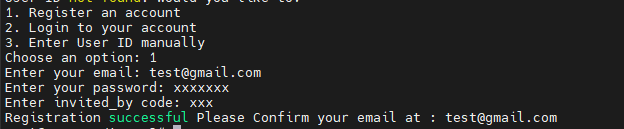
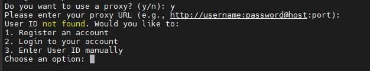
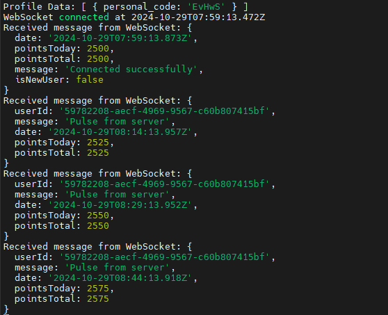

# ᝰ.ᐟ TENEO-NODE

Running Teneo Node BETA, CLI Version. <br>
Teneo Is an Browser extension Node Based. <br>

 <br>
Get paid in $TENEO Tokens for simply running a node that accesses public social media data. It’s easy, passive, and you earn from the value you contribute.


## 💡 How To SignUp (Register)

- **No Need Download the Extension you can register using script**



## 🚨 Attention Before Running Teneo Cli Version

I am not `responsible` for the possibility of an account being `banned`, due to running node in the CLI, because Officially `Teneo Node Beta` does not provide an option for the CLI version, only with the Chrome extension.
but `I think` there is no reason to ban the account, because this is not cheating, I didn't change anything in the script (Heartbeats 15 minutes, maximum teneo points 25, maximum points per day 2400)

## 📎 Teneo Node cli version Script features

- Register
- Login
- Running Node
- AutoLogin
- AutoReconnect



## 📌  ScreenShot Running With Javascript/NodeJs



## ✎ᝰ. RUNNING 
- Clone Repository
```bash
git clone https://github.com/Zlkcyber/teneo-farm.git
cd teneo-farm
```
- Install Dependency
```bash
npm install
```
- Run the script
```bash
node main.js
```
